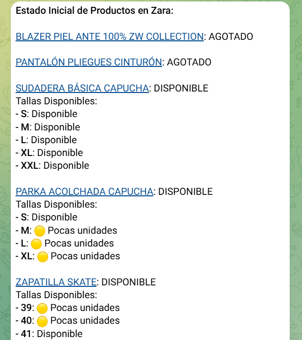

# ZaraTelegramBot
 
# 🛍️ Monitor de Stock de Zara con Notificaciones en Telegram

Este bot supervisa productos de Zara y envía notificaciones a un chat de Telegram cuando un artículo agotado vuelve a estar disponible.  

## 🚀 Características

- ✅ Verifica automáticamente el stock de productos listados en `links.txt`.
- 📢 Envía alertas en Telegram cuando un producto vuelva a estar disponible.
- 📊 Registra estados anteriores en `estados.json` para evitar notificaciones redundantes.
- 🔄 Funciona en bucle con intervalos configurables entre verificaciones.

<div align="center">
  
</div>

## 📦 Instalación

### 1️⃣ Clona este repositorio  
```bash
git clone https://github.com/RodrigoPerez943/ZaraTelegramBot
cd ZaraTelegramBot
```

### 2️⃣ Instala las dependencias  
Primero, asegúrate de tener **Python 3.7 o superior** instalado. Luego, instala los paquetes requeridos:  
```bash
pip install -r requirements.txt
```


## 🔑 Configuración

### 1️⃣ Crear un bot en Telegram  
1. Ve a [@BotFather](https://t.me/BotFather) en Telegram.  
2. Usa el comando `/newbot` y sigue las instrucciones.  
3. Guarda el `TOKEN` del bot proporcionado.  

### 2️⃣ Obtener tu Chat ID  
1. Inicia una conversación con [@userinfobot](https://t.me/useridinfobot).  
2. Te responderá con tu `CHAT_ID`.  

### 3️⃣ Definir las variables
Para que el bot funcione, debes configurar las siguientes variables:  
```bash
TELEGRAM_BOT_TOKEN = os.getenv('TELEGRAM_BOT_TOKEN', 'Tu token aquí')
TELEGRAM_CHAT_ID = os.getenv('TELEGRAM_CHAT_ID', 'Tu id aquí')
```


## 📝 Uso

1. **Agrega los enlaces de Zara en `links.txt`**  
   ```
   https://www.zara.com/xx/producto1.html
   https://www.zara.com/xx/producto2.html
   ```
2. **Ejecuta el script**  
   ```bash
   python ZaraTelegramBot.py
   ```
   El bot verificará los productos y notificará en Telegram si hay cambios de disponibilidad.


## 🛠️ Contribuciones

Las contribuciones son bienvenidas.  
Si deseas mejorar este proyecto, ¡haz un fork y envía un pull request!


## 📜 Licencia

Este proyecto está bajo la licencia **MIT**.
